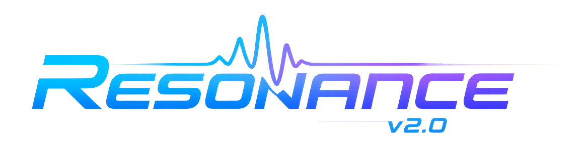
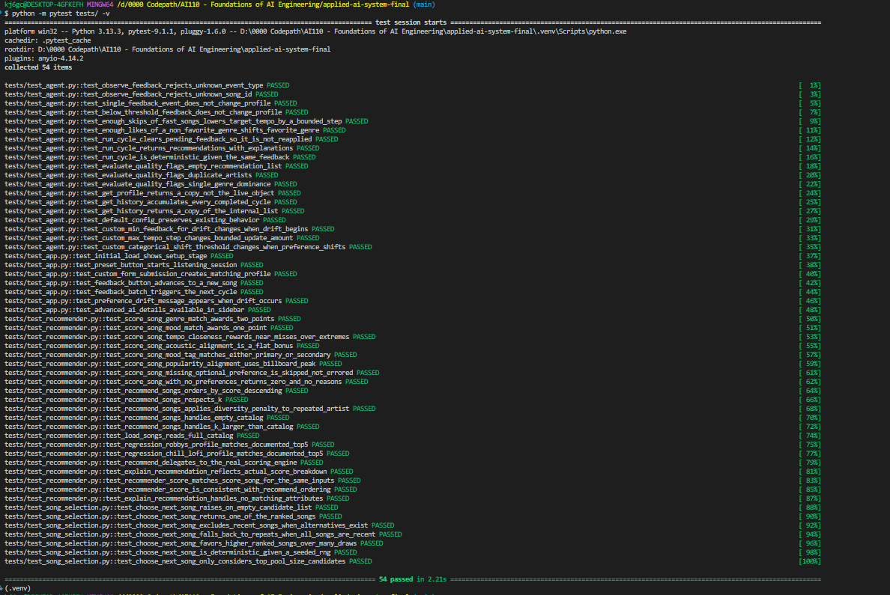
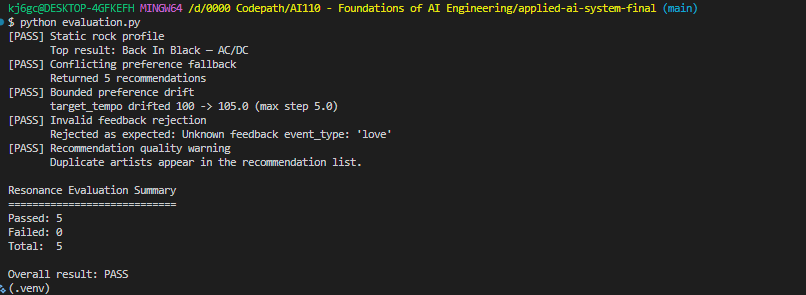
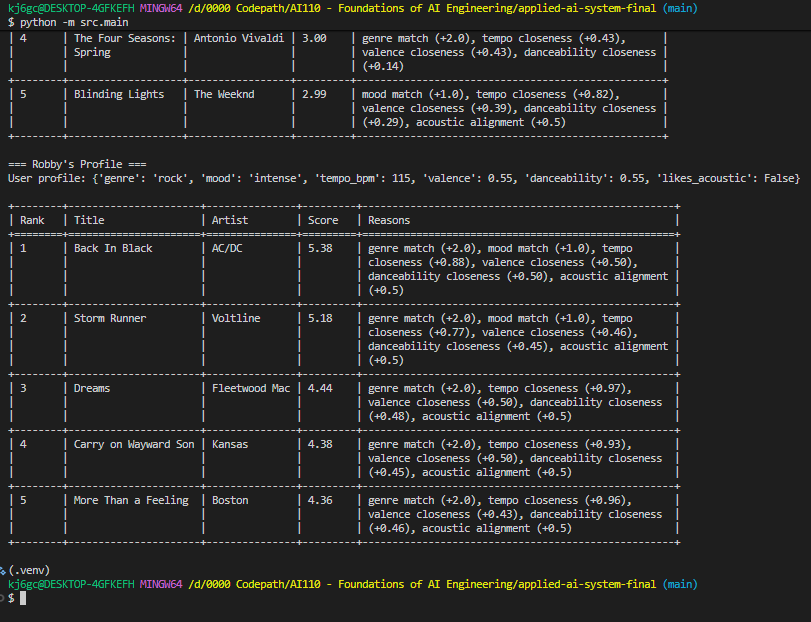
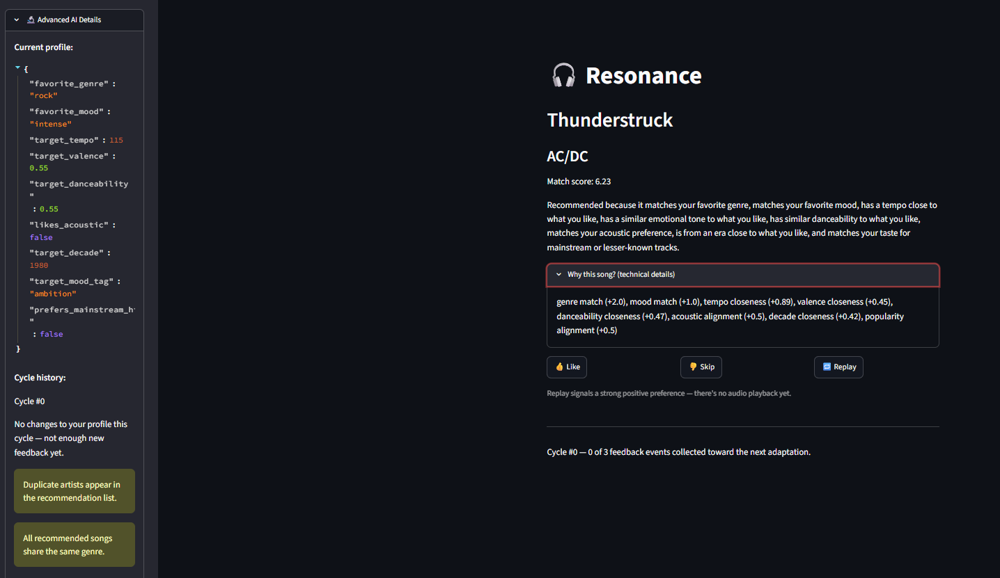
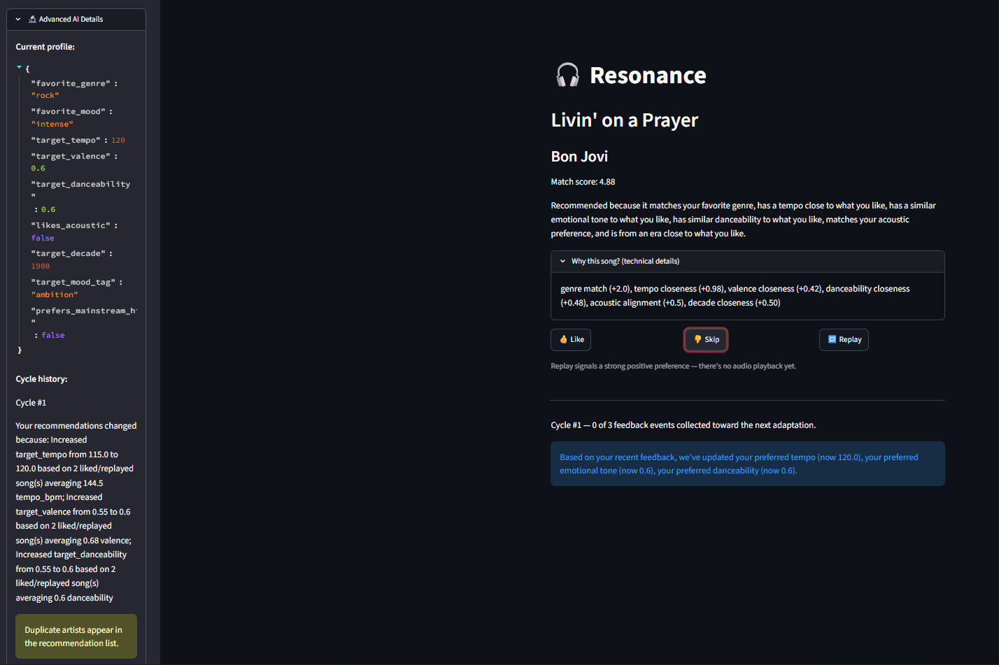
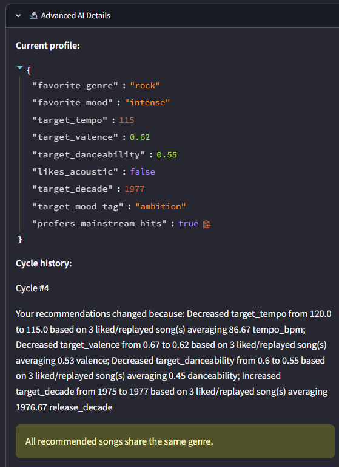
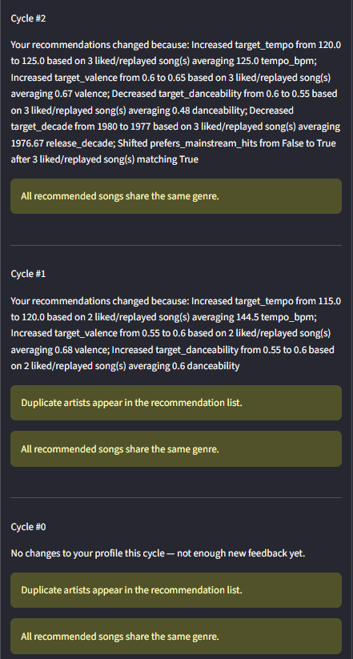

<p align="center">
  
</p>

> **An Adaptive, Explainable Music Recommendation Agent**

[](https://www.python.org/)
[](https://streamlit.io/)
[](https://pytest.org/)
[](LICENSE)

[](model_card.md)
[](ai_interactions.md)
[](changelog.md)
[](diagrams/resonance_v2_architecture.md)

---

## Overview

**Resonance** is an adaptive, explainable AI music recommendation system that learns from listener feedback through transparent recommendation cycles.

Unlike a recommender that relies on one static user profile, Resonance maintains an evolving listener profile that can gradually adapt as the user interacts with recommendations. Every **Like**, **Skip**, and **Replay** contributes evidence that may influence future recommendations while the underlying recommendation engine remains deterministic, testable, and explainable.

At the center of Resonance v2.0 is the **ResonanceAgent**, a stateful AI component responsible for observing listener behavior, detecting preference drift, updating the listener profile, orchestrating recommendation cycles, evaluating recommendation quality, explaining changes, and remembering previous cycles.

### Why "Resonance"?

Music is deeply personal, and listening preferences are not static.

Resonance is named after the way music **resonates** with a listener. Rather than treating preferences as fixed forever, the system allows them to move gradually as new behavioral evidence appears.

The core adaptive cycle is:

> **Observe → Reason → Adapt → Recommend → Explain → Remember**

The listener and the agent therefore continually **resonate with each other**: the listener's behavior changes the profile, and the changed profile influences what the system recommends next.

---

## Project Evolution

Resonance v2.0 evolved from **Resonance v1.0**, originally developed for **CodePath AI-110 Module 3**.

The original version focused on:

- deterministic recommendation scoring;
- weighted recommendation ranking;
- explainable score breakdowns;
- artist-diversity logic; and
- command-line interaction.

For the AI-110 final project, Resonance was extended into a stateful applied AI system featuring:

- a behavioral recommendation agent;
- Like / Skip / Replay feedback;
- bounded preference drift;
- recommendation-cycle history;
- two-layer explainability;
- controlled candidate selection;
- recent-song avoidance;
- a Streamlit listener interface;
- structured logging;
- automated reliability testing; and
- a 210-song local catalog.

The original deterministic recommendation engine remains the scoring foundation used by the ResonanceAgent rather than being replaced by the agent.

---

## Features

### Adaptive Recommendation Agent

The **ResonanceAgent** learns from repeated listener feedback while preserving the deterministic recommendation engine beneath it.

Key behaviors include:

- Like / Skip / Replay feedback;
- stateful listener profiles;
- bounded numeric preference drift;
- evidence-based categorical preference changes;
- recommendation-cycle history;
- quality checks;
- adaptation explanations; and
- configurable drift thresholds through `AgentConfig`.

### Explainable AI

Resonance provides two independent explanation layers.

**Layer 1 — Recommendation Engine**

Answers:

> **Why was this song recommended?**

Possible factors include genre, mood, tempo, valence, danceability, acoustic preference, decade, mood tags, popularity, and artist-diversity penalties.

**Layer 2 — ResonanceAgent**

Answers:

> **Why did my recommendations change?**

The agent explains profile changes between recommendation cycles, including which feedback events supported each change.

### Interactive Streamlit Interface

The Streamlit application allows listeners to:

- choose a quick-start preset or build a custom listener profile;
- receive one song recommendation at a time;
- Like, Skip, or Replay songs;
- watch feedback accumulate toward the next cycle;
- observe profile drift when sufficient evidence exists;
- inspect recommendation explanations;
- review cycle history; and
- explore advanced AI details and quality warnings.

### Reliability

Resonance emphasizes reliability through:

- 54 automated tests;
- deterministic recommendation scoring;
- regression testing;
- feedback validation;
- bounded preference changes;
- recommendation-quality checks;
- recent-song protection;
- configurable agent thresholds;
- Streamlit application tests; and
- structured logging.

---

## Architecture

Resonance separates the listener interface, adaptive agent, deterministic recommender, and session-level song-selection logic.

```text
Listener
   │
   ▼
Streamlit Interface
   │
   ▼
ResonanceAgent
   │
   ├── Observe feedback
   ├── Reason about evidence
   ├── Apply bounded profile drift
   ├── Evaluate recommendation quality
   ├── Explain changes
   └── Remember cycle history
   │
   ▼
Deterministic Recommendation Engine
   │
   ├── Score catalog
   ├── Rank candidates
   ├── Apply artist-diversity penalty
   └── Explain recommendation scores
   │
   ▼
Weighted Session Song Selection
   │
   ├── Prefer stronger candidates
   └── Avoid recently shown songs
   │
   ▼
Next Recommendation
```

The final Mermaid architecture source and rendered GitHub diagram are available in:

[`diagrams/resonance_v2_architecture.md`](diagrams/resonance_v2_architecture.md)

A key design principle is:

> **The recommendation engine determines which songs fit the current profile. The ResonanceAgent determines how that profile evolves over time.**

---

## Technology Stack

| Component             | Technology                   |
| --------------------- | ---------------------------- |
| Language              | Python 3.13                  |
| Interface             | Streamlit                    |
| Testing               | Pytest                       |
| Recommendation Engine | Custom deterministic scoring |
| Agent Architecture    | Stateful orchestration       |
| Data Source           | Local CSV catalog            |
| Version Control       | Git / GitHub                 |

---

## Installation

### Clone the Repository

```bash
git clone https://github.com/kj6gcs/applied-ai-system-final.git
cd applied-ai-system-final
```

### Create a Virtual Environment

**Windows PowerShell**

```powershell
python -m venv .venv
.venv\Scripts\activate
```

**Git Bash**

```bash
python -m venv .venv
source .venv/Scripts/activate
```

**macOS / Linux**

```bash
python3 -m venv .venv
source .venv/bin/activate
```

### Install Dependencies

```bash
pip install -r requirements.txt
```

---

## Running Resonance

Resonance provides two primary entry points.

### Command-Line Interface

Run:

```bash
python -m src.main
```

The CLI evaluates several predefined listener profiles against the catalog and displays:

- ranked recommendations;
- scores;
- recommendation explanations;
- diversity penalties where applicable; and
- deterministic regression behavior.

### Streamlit Application

Launch:

```bash
streamlit run app.py
```

Streamlit should open automatically in a browser. If it does not, navigate to:

```text
http://localhost:8501
```

The Streamlit application is the recommended way to experience the complete adaptive listener workflow.

---

## Listener Experience

### Stage 1 — Build a Listener Profile

A listener can choose a built-in preset or create a custom profile.

Profile attributes include:

- Favorite Genre
- Preferred Mood
- Target Tempo
- Target Valence
- Target Danceability
- Acoustic Preference
- Preferred Decade
- Mood Tag
- Mainstream vs. Discovery Preference

These values provide the initial state from which the ResonanceAgent begins adapting.

### Stage 2 — Continuous Recommendation Session

Resonance presents one song at a time.

For each recommendation, the listener can choose:

- 👍 **Like**
- 👎 **Skip**
- 🔁 **Replay**

Each interaction is recorded as evidence. When sufficient feedback accumulates, the ResonanceAgent can run a new recommendation cycle and update the listener profile.

---

## Recommendation Cycle

The adaptive workflow follows six conceptual stages:

```text
Observe
   ↓
Reason
   ↓
Adapt
   ↓
Recommend
   ↓
Explain
   ↓
Remember
```

### Observe

The agent receives Like, Skip, and Replay feedback and validates both the feedback type and referenced song.

### Reason

The agent evaluates whether enough evidence exists to justify a profile change.

### Adapt

When thresholds are met, the agent applies bounded preference drift. Numeric attributes change gradually, and categorical changes require repeated supporting evidence.

### Recommend

The updated profile is passed to the deterministic recommendation engine, which scores the catalog and produces a ranked candidate pool.

### Explain

Resonance explains both why a song was recommended and why the listener profile changed.

### Remember

The completed cycle is stored in recommendation history with profile snapshots, applied feedback, recommendations, explanations, and quality warnings.

---

## Controlled Candidate Selection

The interactive session does not always display the single highest-ranked song.

Instead:

```text
Listener Profile
      │
      ▼
Recommendation Engine
      │
      ▼
Ranked Candidates
      │
      ▼
Top Candidate Pool
      │
      ▼
Remove Recent Songs
      │
      ▼
Weighted Random Selection
      │
      ▼
Next Recommendation
```

Higher-ranked songs receive greater selection weight, but lower-ranked strong candidates can still appear. This introduces variety while preserving recommendation quality.

The selection layer does **not** calculate scores or change rankings; it only chooses among candidates already evaluated by the recommendation engine.

---

## Project Structure

```text
applied-ai-system-final/
│
├── app.py
├── evaluation.py
├── README.md
├── model_card.md
├── changelog.md
├── ai_interactions.md
├── LICENSE
├── requirements.txt
│
├── assets/
│   ├── automated_pytest_results.png
│   ├── cli_static_profile_test.png
│   ├── evaluation_py_test.png
│   ├── streamlit_agent_profile.png
│   ├── streamlit_cycle_history.png
│   ├── streamlit_listener_interface.png
│   └── streamlit_profile_drift.png
│
├── data/
│   └── songs.csv
│
├── diagrams/
│   ├── resonance_v1_architecture.md
│   └── resonance_v2_architecture.md
│
├── docs/
│   ├── README_v1.md
│   ├── model_card_v1.md
│   ├── ai_interactions_v1.md
│   └── songs_v1_60.csv
│
├── src/
│   ├── agent.py
│   ├── logging_config.py
│   ├── main.py
│   ├── recommender.py
│   └── song_selection.py
│
└── tests/
    ├── test_agent.py
    ├── test_app.py
    ├── test_recommender.py
    └── test_song_selection.py
```

---

# Reproducible Example Interactions

The examples below come from actual final verification runs against the 210-song catalog and are included as fenced input/output evidence.

## Example 1 — Static Rock Profile

```text
INPUT

genre: rock
mood: intense
tempo_bpm: 115
valence: 0.55
danceability: 0.55
likes_acoustic: false

OUTPUT

1. Back In Black — AC/DC — 5.38
2. Storm Runner — Voltline — 5.18
3. Dreams — Fleetwood Mac — 4.44
4. Carry on Wayward Son — Kansas — 4.38
5. More Than a Feeling — Boston — 4.36
```

## Example 2 — Conflicting Preferences

```text
INPUT

genre: metal
mood: peaceful
tempo_bpm: 170
valence: 0.85
danceability: 0.85
likes_acoustic: true

OUTPUT

1. The Trooper — Iron Maiden — 3.52
2. Paranoid — Black Sabbath — 3.50
3. Duality — Slipknot — 3.34
4. Master of Puppets — Metallica — 3.26
5. Chop Suey! — System of a Down — 3.23
```

This intentionally conflicting profile demonstrates that Resonance returns the strongest available partial matches instead of failing when no song satisfies every requested characteristic.

## Example 3 — Adaptive Agent Cycle

```text
INPUT

3 liked/replayed songs
average tempo_bpm: 125.0
average valence: 0.67
average danceability: 0.48
average release decade: 1976.67
3/3 songs matched prefers_mainstream_hits = true

BEHAVIOR

ResonanceAgent evaluates the accumulated evidence and applies
bounded preference drift using AgentConfig.

OUTPUT

target_tempo: 120 → 125
target_valence: 0.60 → 0.65
target_danceability: 0.60 → 0.55
target_decade: 1980 → 1977
prefers_mainstream_hits: false → true
```

This observed Cycle #2 example demonstrates both bounded numeric drift and an evidence-thresholded categorical/Boolean preference shift.

---

# Testing & Validation

Resonance v2.0 is validated through automated testing, deterministic CLI execution, and interactive Streamlit testing.

The final verification examples use the expanded **210-song catalog**.

## Automated Test Suite

Reproduce the complete automated suite with:

```bash
python -m pytest tests/ -v
```

The final verification run executed **54 automated tests** covering:

- recommendation scoring and ranking;
- recommendation explanations;
- artist-diversity behavior;
- catalog loading;
- deterministic regression profiles;
- feedback validation;
- bounded preference drift;
- configurable `AgentConfig` behavior;
- recommendation-cycle history;
- weighted song selection;
- recent-song avoidance; and
- Streamlit interface behavior.

Final result: **54 of 54 tests passed.**



_Final automated verification run confirming all 54 tests pass successfully._

---

## System Evaluation Harness

Resonance includes a separate system-level evaluation harness in addition to the pytest suite.

Run:

```bash
python evaluation.py
```

The harness evaluates five predefined scenarios against the real recommendation engine, `ResonanceAgent`, and 210-song catalog:

1. static rock recommendation baseline;
2. conflicting-preference fallback;
3. bounded preference drift;
4. invalid feedback rejection; and
5. recommendation-quality warning detection.

The final verification run produced:

```text
[PASS] Static rock profile
       Top result: Back In Black — AC/DC
[PASS] Conflicting preference fallback
       Returned 5 recommendations
[PASS] Bounded preference drift
       target_tempo drifted 100 -> 105.0 (max step 5.0)
[PASS] Invalid feedback rejection
       Rejected as expected: Unknown feedback event_type: 'love'
[PASS] Recommendation quality warning
       Duplicate artists appear in the recommendation list.

Resonance Evaluation Summary
============================
Passed: 5
Failed: 0
Total:  5

Overall result: PASS
```

The script also returned exit code `0`, confirming that all predefined evaluation scenarios completed successfully.



_Final system-level evaluation run confirming all five predefined acceptance scenarios pass successfully._

## Static CLI Profile Test

Reproduce the deterministic CLI run with:

```bash
python -m src.main
```

The final verification run successfully loaded all **210 songs** and exercised multiple listener profiles and edge cases.

For the documented static rock-oriented profile, the top five were:

| Rank | Title                | Artist        | Score |
| ---: | -------------------- | ------------- | ----: |
|    1 | Back In Black        | AC/DC         |  5.38 |
|    2 | Storm Runner         | Voltline      |  5.18 |
|    3 | Dreams               | Fleetwood Mac |  4.44 |
|    4 | Carry on Wayward Son | Kansas        |  4.38 |
|    5 | More Than a Feeling  | Boston        |  4.36 |

Each recommendation also included an explanation identifying the scoring factors that contributed to its ranking.



_Final CLI verification showing ranked recommendations and explainable scoring for the documented static profile._

### Expanded Catalog Regression Validation

The original catalog contained 60 songs. Resonance v2.0 now evaluates **210 songs**, increasing the candidate pool by 250%.

After the expansion, `Carry on Wayward Son` and `More Than a Feeling` legitimately entered the static rock profile's top five.

The recommendation algorithm and scoring weights were **not changed** to produce these results. The existing engine simply had better candidates available.

The regression baseline was updated only after manually reviewing the new rankings and explanations.

---

## Interactive Streamlit Testing

The final interactive verification was performed through a fresh multi-cycle listening session:

```bash
streamlit run app.py
```

The session verified the complete listener feedback loop:

**Listener interaction → feedback collection → agent reasoning → bounded profile adaptation → new recommendations → explanation → cycle history**



_The listener-facing Streamlit interface presents one recommendation at a time and allows the listener to Like, Skip, or Replay it._

### Observed Adaptive Behavior

The final verification session progressed through four adaptive recommendation cycles.

One particularly useful example occurred during **Cycle #2**. Three liked/replayed songs provided enough evidence for Resonance to update several listener preferences:

```text
target_tempo:         120.0 → 125.0
target_valence:       0.60  → 0.65
target_danceability:  0.60  → 0.55
target_decade:        1980  → 1977
prefers_mainstream_hits: False → True
```

The Boolean preference changed only after the required supporting evidence was observed:

```text
Shifted prefers_mainstream_hits from False to True
after 3 liked/replayed song(s) matching True
```



_Observed preference drift after accumulated listener feedback triggered a new recommendation cycle._

### Continued Adaptation

Later cycles demonstrated that preference drift is **not permanently directional**.

For example, tempo changed throughout the session:

```text
115 → 120 → 125 → 120 → 115 BPM
```

Rather than continually increasing the value, Resonance responded to newer evidence and moved the target back downward when subsequent liked/replayed songs supported slower tempos.

The same behavior appeared across valence, danceability, and preferred decade.

After Cycle #4, the active profile was:

```text
favorite_genre: rock
favorite_mood: intense
target_tempo: 115
target_valence: 0.62
target_danceability: 0.55
likes_acoustic: false
target_decade: 1977
target_mood_tag: ambition
prefers_mainstream_hits: true
```



_The listener profile after four adaptive recommendation cycles._

### Recommendation Quality Monitoring

The same session also demonstrated the independent recommendation-quality evaluation layer.

Resonance detected:

```text
Duplicate artists appear in the recommendation list.
```

and:

```text
All recommended songs share the same genre.
```

These warnings do not automatically alter the recommendation results. Instead, they expose potentially undesirable characteristics for inspection while preserving the recommendation engine's deterministic behavior.



_Advanced AI Details showing recommendation-cycle history, adaptation explanations, and quality warnings._

# Reliability Strategy

Resonance combines several reliability techniques rather than relying on one metric.

## Deterministic Recommendation Engine

Given the same:

- catalog;
- listener profile; and
- scoring configuration,

the engine produces the same ranking.

This makes recommendation behavior reproducible and enables regression testing.

## Regression Testing

Known recommendation outputs are used to detect unintended changes.

When the catalog itself changed from 60 to 210 songs, the regression baseline was intentionally updated only after reviewing why new songs entered the ranking.

## Bounded Preference Drift

Resonance does not dramatically rewrite a profile after one interaction.

Default adaptation settings are:

| Setting                         |             Default |
| ------------------------------- | ------------------: |
| Minimum feedback before drift   |            3 events |
| Categorical shift threshold     | 3 supporting events |
| Maximum tempo adjustment        |               5 BPM |
| Maximum valence adjustment      |                0.05 |
| Maximum danceability adjustment |                0.05 |
| Maximum decade adjustment       |             5 years |

These limits make adaptation gradual and explainable.

## Configurable Agent Behavior

`AgentConfig` exposes the adaptation thresholds while preserving the validated defaults.

Automated tests verify that:

- default configuration preserves existing behavior;
- changing the minimum feedback threshold changes when drift begins;
- changing numeric step limits changes the maximum profile adjustment; and
- changing categorical thresholds changes when categorical preferences shift.

---

# Guardrails & Error Handling

## Feedback Validation

The agent accepts only:

```text
like
skip
replay
```

Unknown feedback types and unknown song IDs are rejected.

## Controlled Adaptation

Bounded changes protect the system from:

- isolated outliers;
- accidental clicks;
- sudden profile instability; and
- overreaction to limited evidence.

## Recommendation Quality Checks

The agent can identify:

- empty recommendation lists;
- repeated artists; and
- excessive single-genre dominance.

Warnings are surfaced for inspection rather than silently rewriting results.

## Recent-Song Protection

The session tracks recently displayed songs and avoids them when alternatives are available. If every strong candidate was recently shown, the system safely allows a repeat rather than failing.

## Structured Logging

Structured logging records useful diagnostic information without mixing debug output with user-facing recommendation output.

## Guardrail Examples

| Input / Condition                                 | System Behavior                             | Result                                                      |
| ------------------------------------------------- | ------------------------------------------- | ----------------------------------------------------------- |
| Unknown feedback type                             | `ResonanceAgent` rejects the event          | Invalid feedback cannot influence the listener profile      |
| Unknown song ID                                   | Agent rejects the event                     | Invalid song references do not enter agent state or history |
| Only one feedback event                           | Minimum drift threshold prevents adaptation | Listener profile remains unchanged                          |
| Strong tempo evidence far from the current target | `AgentConfig` clamps the numeric update     | Tempo changes by no more than 5 BPM in one default cycle    |
| Duplicate artists in the recommendation set       | Quality evaluator raises a warning          | `Duplicate artists appear in the recommendation list.`      |
| All recommendations share one genre               | Quality evaluator raises a warning          | `All recommended songs share the same genre.`               |
| All strong session candidates were recently shown | Recent-song protection falls back safely    | A repeat is allowed rather than failing to return a song    |

These mechanisms improve reliability without silently replacing the recommendation engine's decisions.

---

# Interface Reliability

Streamlit reruns the Python script as users interact with widgets. Resonance uses `st.session_state` to preserve:

- the active listener profile;
- `ResonanceAgent`;
- recommendation engine;
- active song;
- recent song IDs;
- feedback count for the current cycle;
- latest drift explanation; and
- current application stage.

The active song changes only when the listening workflow explicitly advances. This helps ensure a Like, Skip, or Replay applies to the song the listener actually saw.

Automated Streamlit tests verify that:

- the setup screen renders;
- presets begin a listening session;
- custom profiles create the expected `UserProfile`;
- feedback advances to a new song;
- three feedback events trigger a new cycle;
- visible preference drift appears when expected; and
- Advanced AI Details remain available.

---

# Explainable AI

Explainability is a central design goal.

## Layer 1 — Why This Song?

The recommendation engine can explain factors such as:

- genre match;
- mood alignment;
- tempo closeness;
- valence similarity;
- danceability similarity;
- acoustic preference;
- decade preference;
- mood-tag alignment;
- popularity preference; and
- diversity penalties.

## Layer 2 — Why Did My Recommendations Change?

The ResonanceAgent explains how the profile changed between cycles and what recent feedback supported the change.

The distinction is intentional:

> The recommendation engine explains a **decision**.  
> The ResonanceAgent explains **adaptation over time**.

---

# Design Decisions & Trade-Offs

## Deterministic Engine + Stateful Agent

Instead of replacing the original scoring system with a generative model, Resonance preserves the transparent engine and places a stateful agent above it.

This provides:

- reproducibility;
- transparent scoring;
- easier automated testing;
- clear separation of responsibilities; and
- adaptive behavior without sacrificing explainability.

The trade-off is that Resonance does not learn complex latent preference representations like a large production recommender.

## Gradual Adaptation Instead of Immediate Learning

A single Like or Skip may be noise. Requiring multiple events slows adaptation but improves stability.

## Weighted Selection Instead of Pure Randomness

Pure randomness creates variety but weakens personalization. Always choosing rank #1 becomes repetitive.

Resonance ranks first, then introduces controlled randomness among strong candidates.

## Local Catalog Instead of a Live Music API

The local CSV catalog keeps the project:

- reproducible;
- offline-capable;
- credential-free;
- unaffected by API rate limits; and
- stable for grading and testing.

A future catalog-provider abstraction could add an external music service without replacing the recommendation engine.

## Session State Instead of Persistent Accounts

Profiles currently persist only during the active Streamlit session.

This avoids database credentials and external dependencies while keeping the project focused on the adaptive workflow. Persistent profile storage remains a future enhancement.

---

# Testing Summary

At the final documented testing milestone:

> **54 automated tests pass against the 210-song catalog.**

Testing demonstrates that:

- recommendation scoring remains deterministic;
- the ResonanceAgent applies bounded preference drift;
- configuration changes affect adaptation predictably;
- invalid feedback is rejected;
- recommendation history is preserved;
- controlled randomness favors stronger candidates;
- recently shown songs are avoided when possible;
- Streamlit maintains active-session state; and
- recommendation cycles trigger automatically after sufficient feedback.

The central reliability lesson was that adding adaptive behavior did not require replacing the deterministic engine. Separating **recommendation** from **adaptation** made both components easier to test.

---

# Known Limitations

Resonance remains a course-scale prototype.

Current limitations include:

- a local, curated 210-song catalog rather than a production-scale catalog;
- heuristic audio-feature metadata rather than a fully authoritative audio-analysis dataset;
- no direct playback or streaming integration;
- no persistent user accounts or database-backed profiles;
- rule-based preference adaptation rather than learning from a large behavioral dataset;
- incomplete representation across genres, eras, languages, regions, and artists;
- feedback limited to Like, Skip, and Replay;
- session history that ends with the active application session; and
- controlled randomness that can produce different song sequences between unseeded sessions.

These limitations are documented rather than hidden and provide clear directions for future development.

---

# What I Learned

Building Resonance v2.0 reinforced that an applied AI system is more than the model or algorithm producing an output.

The engineering challenge involved:

- deciding what state should be remembered;
- determining when feedback is strong enough to justify adaptation;
- preventing unstable profile changes;
- separating recommendation logic from agent behavior;
- making both recommendations and adaptation explainable;
- testing stateful workflows;
- managing randomness without losing reproducibility; and
- presenting technical AI behavior through a usable interface.

The most important architectural lesson was:

> **The recommendation engine does not need to be the agent. It can be a tool the agent uses.**

---

# Future Roadmap

## External Music Catalog

A future catalog-provider abstraction could support both the current CSV and an external music service:

```text
Catalog Provider
      │
  ┌───┴───┐
  ▼       ▼
Local    Music
 CSV      API
```

Potential benefits include a much larger catalog, richer metadata, international music, new releases, artwork, and supported preview/playback links.

## Persistent Listener Profiles

A future database layer such as PostgreSQL or Supabase could preserve:

- listener accounts;
- profile preferences;
- feedback history;
- recommendation cycles;
- drift history; and
- previously recommended songs.

## Expanded Feedback Signals

Future behavioral signals could include:

- listening duration;
- early skips;
- playlist additions;
- favorites;
- search behavior;
- manual ratings;
- artist follows; and
- time-of-day patterns.

## Improved Diversity

Future diversity controls could consider:

- genre;
- decade;
- artist;
- language;
- popularity; and
- geographic origin.

## Richer Preference Modeling

Future experiments could compare the current transparent baseline against:

- embeddings;
- collaborative filtering; or
- learned preference representations.

## Natural-Language Explanations

A future language model could translate deterministic structured explanations into more conversational wording while leaving recommendation decisions themselves deterministic.

---

# Development Status

Resonance v2.0 is feature-complete for the CodePath AI-110 final project and is in final documentation/evaluation preparation.

### Completed

- [x] Deterministic recommendation engine
- [x] Explainable recommendation scoring
- [x] Artist-diversity behavior
- [x] 210-song local catalog
- [x] ResonanceAgent
- [x] Listener feedback collection
- [x] Bounded preference drift
- [x] Configurable agent behavior
- [x] Recommendation-cycle history
- [x] Two-layer explainability
- [x] Structured logging
- [x] Controlled candidate selection
- [x] Recent-song avoidance
- [x] Listener profile builder
- [x] Interactive Streamlit application
- [x] Final architecture diagram
- [x] Final `model_card.md`
- [x] Final `ai_interactions.md`
- [x] 54-test automated suite
- [x] Automated-test screenshot
- [x] CLI verification screenshot

---

# Portfolio Reflection

Resonance demonstrates my progression from building an AI-related component to designing a complete applied AI system.

The original project asked:

> **Which songs best match this predefined profile?**

Resonance v2.0 adds a second question:

> **What happens after the recommendation?**

The system now observes behavior, reasons about accumulated feedback, applies controlled preference drift, generates new recommendations, explains its decisions, and remembers previous cycles.

For me, Resonance represents a shift from thinking primarily about **what an AI component can produce** to thinking about **how an AI system should behave over time**.

---

# Original Project

Resonance v2.0 evolved from my original **CodePath AI-110 Module 3 music recommendation project, Resonance v1.0**.

**Original repository:**  
https://github.com/kj6gcs/ai110-module3show-musicrecommendersimulation-starter

Historical artifacts are preserved in this repository:

- [`docs/README_v1.md`](docs/README_v1.md)
- [`docs/model_card_v1.md`](docs/model_card_v1.md)
- [`docs/ai_interactions_v1.md`](docs/ai_interactions_v1.md)
- [`docs/songs_v1_60.csv`](docs/songs_v1_60.csv)

---

# AI-Assisted Development

Generative AI tools were used as engineering collaborators for:

- architecture discussion;
- codebase review;
- implementation planning;
- code generation;
- test design;
- debugging;
- design critique;
- documentation; and
- technical review.

AI suggestions were reviewed rather than accepted automatically. Several proposals were modified, deferred, or rejected when they introduced unnecessary complexity, conflicted with the intended product experience, or expanded beyond project scope.

See:

- [`model_card.md`](model_card.md) for responsible-AI and collaboration reflection;
- [`ai_interactions.md`](ai_interactions.md) for representative development traces.

---

# Responsible AI

Resonance emphasizes:

### Transparency

Recommendation and adaptation logic remain inspectable.

### Stability

Profiles change gradually through bounded preference drift.

### Human Control

Listener feedback drives adaptation, and changes remain visible.

### Reproducibility

The local catalog and deterministic engine allow core behavior to be reproduced without external AI services.

### Bias Awareness

The system documents limitations related to catalog composition, metadata, genre representation, and hand-designed scoring rules.

See [`model_card.md`](model_card.md) for the complete responsible-AI discussion.

---

# Repository Documentation

| File                                                                             | Purpose                                                                            |
| -------------------------------------------------------------------------------- | ---------------------------------------------------------------------------------- |
| [`README.md`](README.md)                                                         | Main project documentation                                                         |
| [`model_card.md`](model_card.md)                                                 | Responsible AI, limitations, testing observations, and AI-collaboration reflection |
| [`ai_interactions.md`](ai_interactions.md)                                       | AI-assisted development log and agentic workflow evidence                          |
| [`changelog.md`](changelog.md)                                                   | Development and release history                                                    |
| [`diagrams/resonance_v2_architecture.md`](diagrams/resonance_v2_architecture.md) | Final Mermaid system architecture                                                  |
| [`docs/README_v1.md`](docs/README_v1.md)                                         | Archived Resonance v1.0 README                                                     |

---

# License

Resonance is released under the MIT License.

See [`LICENSE`](LICENSE).

---

# Acknowledgements

Resonance was developed as part of **CodePath AI-110: Foundations of AI Engineering**.

Thanks to:

- **CodePath** for the curriculum, project framework, and development resources;
- the Python, Streamlit, and pytest communities; and
- generative AI tools used as development collaborators throughout design, implementation, review, testing, and documentation.

---

# About the Author

**Robby Wideman**

Cybersecurity student and developer with interests in defensive security, AI engineering, automation, networking, and open-source software.

Resonance reflects my interest in building systems that are not only functional, but also transparent, testable, explainable, and understandable to the people who use them.

GitHub: [@kj6gcs](https://github.com/kj6gcs)

---

# Final Thought

Music taste is not static.

Neither should the system trying to understand it be.

Resonance begins with a listener profile, but it does not assume that profile tells the entire story. Every Like, Skip, and Replay provides new evidence. Through repeated recommendation cycles, the system observes, reasons, adapts, recommends, explains, and remembers.

The goal is not simply to predict what song should come next.

It is to create an ongoing, transparent interaction in which the recommendation system continually **resonates with the listener**.

---

**Resonance v2.0**  
_An Adaptive, Explainable Music Recommendation Agent_

---

## Portfolio Artifact

**GitHub Repository:** [Resonance v2.0](https://github.com/kj6gcs/applied-ai-system-final)

### What This Project Says About Me as an AI Engineer

Resonance reflects my approach to AI engineering as a combination of experimentation, transparency, reliability, and human oversight. I began with a relatively simple deterministic recommendation system and expanded it into an adaptive system that can observe listener feedback, reason about accumulated evidence, make bounded changes to a user profile, and explain why its behavior changed.

Throughout development, I used generative AI as both a development tool and a learning resource, but I also independently tested its suggestions, identified incorrect or incomplete AI-generated code, and made corrections based on observed system behavior. This project reinforced for me that effective AI engineering is not simply about making a system more autonomous; it is about building systems whose behavior can be understood, tested, evaluated, and improved.

---

## Navigation

- [`README.md`](README.md) — project overview, setup, architecture, usage, testing, and reproducible execution evidence
- [`ai_interactions.md`](ai_interactions.md) — AI-assisted development interactions and reasoning traces
- [`changelog.md`](changelog.md) — development history
- [`diagrams/resonance_v2_architecture.md`](diagrams/resonance_v2_architecture.md) — final Mermaid architecture source
- [`docs/model_card_v1.md`](docs/model_card_v1.md) — archived Resonance v1.0 model card
- [`docs/README_v1.md`](docs/README_v1.md) — archived Resonance v1.0 README

← [Back to Resonance](README.md)
