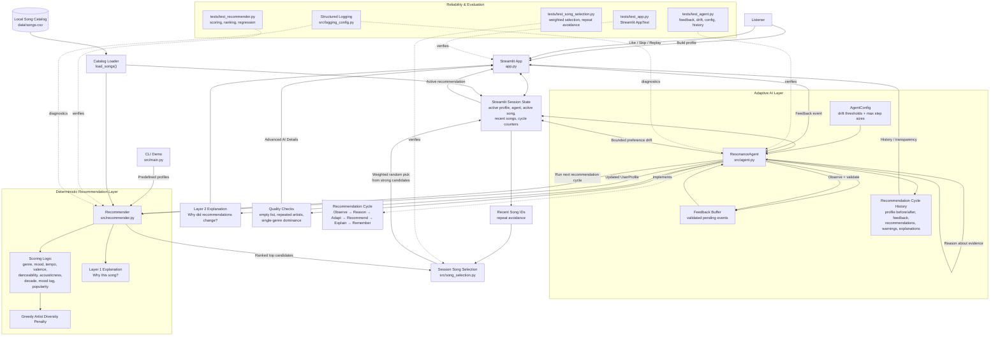

# Resonance v2.0 System Architecture

[README](../README.md) •
[Model Card](../model_card.md) •
[AI Interactions](../ai_interactions.md) •
[Changelog](../changelog.md) •
[License](../LICENSE)

---

This diagram shows the primary components of Resonance v2.0, the flow of listener feedback through the adaptive agent, and the reliability/testing layers used to validate the system.



## Architecture Overview

Resonance v2.0 separates the listener-facing experience from the adaptive agent and the deterministic recommendation engine.

The **Streamlit interface** manages the interactive session. It allows a listener to create an initial profile, receive one recommendation at a time, and respond with **Like**, **Skip**, or **Replay** feedback.

The **ResonanceAgent** is the stateful AI layer. It validates feedback, accumulates evidence, evaluates whether preference drift is justified, applies bounded profile changes, requests new recommendations, performs lightweight quality checks, explains adaptation, and stores recommendation-cycle history.

The **recommendation engine** remains deterministic. It scores and ranks songs using explicit features such as genre, mood, tempo, valence, danceability, acousticness, decade, mood tags, and popularity preference. Existing artist-diversity behavior remains part of the ranking logic.

The **song-selection layer** introduces controlled variety after ranking. It selects from strong candidates using weighted randomness while avoiding recently shown tracks when possible. It does not calculate recommendation scores or replace the recommendation engine.

The **reliability layer** includes automated tests for scoring/ranking, agent behavior, candidate selection, and Streamlit interaction, plus structured logging for diagnostics.

---

## Recommendation Cycle

The adaptive workflow follows six conceptual stages:

```text
Observe
   ↓
Reason
   ↓
Adapt
   ↓
Recommend
   ↓
Explain
   ↓
Remember
```

### Observe

The listener provides feedback on the active recommendation.

### Reason

The agent evaluates whether enough consistent evidence has accumulated to justify a profile change.

### Adapt

If the evidence threshold is met, the agent applies bounded preference drift using `AgentConfig`.

### Recommend

The updated profile is passed to the deterministic recommendation engine.

### Explain

Resonance provides two explanation layers:

1. **Why this song?** — generated by the recommendation engine.
2. **Why did my recommendations change?** — generated by the `ResonanceAgent`.

### Remember

The completed recommendation cycle is recorded in history so the system remains transparent and inspectable.

---

## Key Design Principle

> **The recommendation engine determines which songs fit the current profile. The ResonanceAgent determines how that profile evolves over time.**

That separation allows the system to become adaptive without replacing the transparent and reproducible scoring logic validated in Resonance v1.0.

---

← [Back to Resonance](../README.md)
